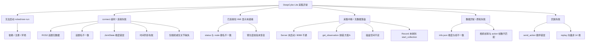

# DeepCybo Lite — RoboDriver 接入包使用说明

本文档说明 `robodriver-robot-deepcybo-lite-aio-ros2` 的 ROS2 话题约定、数据语义与接入方式。  
**话题名的权威定义**在代码类 `DeepcyboLiteRos2Topics`（`robodriver_robot_deepcybo_lite_aio_ros2/config.py`）；修改默认话题时请同步更新本文档。

---

## 1. 包概览

| 项目 | 说明 |
|------|------|
| pip 包名 | `robodriver_robot_deepcybo_lite_aio_ros2` |
| RoboDriver 机器人类型 | `deepcybo-lite-aio-ros2` |
| 模式 | **aio**（单包同时采集 observation + action，无需独立 teleoperator） |
| 本体 | 当前接入 `bar_ws` arms 模式：双臂共 14 关节；夹爪/底盘暂未接入 |
| 典型频率 | 关节 / 相机 / node 限频 / Record 均为 **30 Hz** |
| 相机 | 头部、左腕、右腕共 3 路 |
| ROS2 发行版 | **Jazzy**（`source /opt/ros/jazzy/setup.bash`） |
| RoboDriver Python 环境 | conda env **`robodriver_py312`** |

---

## 2. `DeepcyboLiteRos2Topics` 话题约定

类路径：`robodriver_robot_deepcybo_lite_aio_ros2.config.DeepcyboLiteRos2Topics`

语义约定：

- **Observation（follower）**：机器人当前反馈状态 → 对应 `recv_follower`，落盘为 `observation.state` + 图像。
- **Action（leader）**：遥操 / 目标指令 → 对应 `recv_leader`，落盘为 `action`。
- **相机**：仅进入 observation（`observation.images.*`），不参与 action 向量。

### 2.1 Observation — 从臂本体反馈（30 Hz）

消息类型：`sensor_msgs/msg/JointState`

| 配置字段 | 默认 ROS2 话题名 | 维度 / 约束 | 说明 |
|----------|------------------|-------------|------|
| `joint_states` | `/slave/lite/joint_states` | 14 个 canonical arm joints | 从臂当前关节角（rad），来自 `joint_state_broadcaster` |

`node.py` 会按 `config.py:ARM_JOINT_NAMES` 重排 `JointState.name` / `position`，而不是信任消息原始数组顺序。

### 2.2 Action — 从臂控制指令（30 Hz）

消息类型：`bar_msgs/msg/MITCommand`

| 配置字段 | 默认 ROS2 话题名 | 维度 / 约束 | 说明 |
|----------|------------------|-------------|------|
| `command` | `/slave/remote_policy_controller/command` | 14 个 canonical arm joints | 发往从臂 `remote_policy_controller` 的目标关节 |

采集时 `node.py` 订阅该 MITCommand 并只记录 `position` 作为 action 向量；回放时 `robot.send_action()` 会发布同一话题，补齐 `velocity=0`、`effort=0`、`stiffness=config.command_stiffness`、`damping=config.command_damping`。

### 2.3 相机（30 Hz）

消息类型建议：`sensor_msgs/msg/CompressedImage`（jpeg/png 等，由 `node.py` 解码为 RGB）

| 配置字段 | 默认 ROS2 话题名 | 采集 key（config / 落盘） | 默认分辨率 |
|----------|------------------|---------------------------|------------|
| `camera_head` | `/deepcybo/lite/camera/head/image_raw/compressed` | `image_head` | 640 × 480 |
| `camera_wrist_left` | `/deepcybo/lite/camera/wrist_left/image_raw/compressed` | `image_wrist_left` | 640 × 480 |
| `camera_wrist_right` | `/deepcybo/lite/camera/wrist_right/image_raw/compressed` | `image_wrist_right` | 640 × 480 |

解码时若实际分辨率不是 640×480，`node.py` 会 `resize` 到该尺寸再写入缓存。

### 2.3.1 机械臂向量校验（node.py）

对 `/slave/lite/joint_states` 和 `/slave/remote_policy_controller/command`：

- **完整**：消息中包含全部 `ARM_JOINT_NAMES`，按 canonical 顺序重排为 14 维并写入 `recv_follower` / `recv_leader`。
- **缺失或维度错误**：抛出 `JointVectorError` → 记录 **Warning** → **清空**对应缓存（`pop` + `status=0`），本帧不参与落盘；`Record` 读不到有效臂状态直至恢复。
- **从中断恢复**：首次合法帧写入后打 **Info** 日志「机械臂向量已恢复」。

### 2.4 限频：统一 30 Hz

| 参数 | 默认值 | 作用对象 | 设计说明 |
|------|--------|----------|----------|
| `control_fps` | 30 | `/slave/lite/joint_states` 与 `/slave/remote_policy_controller/command` 回调 | 与 Record 主循环一致；避免高于 30 Hz 重复写缓存 |
| `camera_fps` | 30 | 3 路相机同步回调 | 与相机帧率一致；解码在 30 Hz 下处理 |

控制链路若以 50 Hz 发布关节状态或 MITCommand，node 限频后**最多 30 Hz 更新缓存**；与 Record 采帧对齐。

### 2.5 与旧版 4 路 JointState 方案的区别

旧雏形曾使用 `/deepcybo/lite/feedback/joint_state/*` 与 `/deepcybo/lite/command/joint_state/*` 共 8 路 JointState，并拼成 16 维（含双夹爪）。当前版本已改为 `bar_ws` 原生控制链路：

| 语义 | 当前话题 | 类型 |
|------|----------|------|
| 从臂状态 | `/slave/lite/joint_states` | `sensor_msgs/JointState` |
| 从臂控制指令 | `/slave/remote_policy_controller/command` | `bar_msgs/MITCommand` |

---

## 3. 状态 / 动作向量拼接（14 维）

`node.py` 将 `JointState` / `MITCommand` 按 `ARM_JOINT_NAMES` 重排为单向量，顺序**必须与** `bar_bringup_lite/config/lite_hardware.yaml:joints.arm_joints` 一致：

```
0   left_shoulder_pitch
1   left_shoulder_roll
2   left_shoulder_yaw
3   left_elbow_pitch
4   left_wrist_yaw
5   left_wrist_roll
6   left_wrist_pitch
7   right_shoulder_pitch
8   right_shoulder_roll
9   right_shoulder_yaw
10  right_elbow_pitch
11  right_wrist_yaw
12  right_wrist_roll
13  right_wrist_pitch
```

| 缓存键（node） | 组件名（config 外层 key） | 用途 |
|----------------|---------------------------|------|
| `recv_follower["follower_arms"]` | `follower_arms` | observation.state（14 维） |
| `recv_leader["leader_arms"]` | `leader_arms` | action（14 维） |

落盘时字段名示例（LeRobot / DoRobot）：

- `follower_left_shoulder_pitch.pos` … `follower_right_wrist_pitch.pos`
- `leader_left_shoulder_pitch.pos` … `leader_right_wrist_pitch.pos`

---

## 4. 中台发布检查清单

接入前请确认：

1. 已 `source` 与机器人相同的 ROS2 环境（**Jazzy**：`source /opt/ros/jazzy/setup.bash`），且 `ROS_DOMAIN_ID` 一致。
2. `/slave/lite/joint_states` 和 `/slave/remote_policy_controller/command` 均有数据（可用 `ros2 topic hz` 抽查）。
3. `JointState.name` / `MITCommand.joint_names` 均包含完整 14 个 `ARM_JOINT_NAMES`。
4. 相机为压缩图时发布在 **compressed** 话题；若为 `Image`，需在 `node.py` 中改订阅类型。
5. 话题名与上表不一致时：改 `config.py` 中 `DeepcyboLiteRos2Topics` 默认值，并更新本文档第 2 节。

---

## 5. 修改默认话题

### 5.1 改代码默认值

编辑 `robodriver_robot_deepcybo_lite_aio_ros2/config.py` 中 `DeepcyboLiteRos2Topics` 各字段，例如：

```python
@dataclass
class DeepcyboLiteRos2Topics:
    joint_states: str = "/your_ns/lite/joint_states"
    command: str = "/your_ns/remote_policy_controller/command"
    camera_head: str = "/your_ns/camera/head/image_raw/compressed"
    camera_wrist_left: str = "/your_ns/camera/wrist_left/image_raw/compressed"
    camera_wrist_right: str = "/your_ns/camera/wrist_right/image_raw/compressed"
```

### 5.2 运行时覆盖（若后续 robot 支持传 config）

```python
from robodriver_robot_deepcybo_lite_aio_ros2.config import (
    DeepcyboLiteAioRos2RobotConfig,
    DeepcyboLiteRos2Topics,
)

cfg = DeepcyboLiteAioRos2RobotConfig(
    ros2_topics=DeepcyboLiteRos2Topics(
        joint_states="/custom/lite/joint_states",
        command="/custom/remote_policy_controller/command",
        camera_head="/custom/camera/head/image_raw/compressed",
    )
)
```

---

## 6. 安装与启动（简要）

```bash
# 1. 安装 RoboDriver 主工程
cd /path/to/RoboDriver
pip install -e .

# 2. 安装本 Lite 包
cd robodriver/robots/robodriver-robot-deepcybo-lite-aio-ros2
pip install -e .

# 3. 启动 ROS2 中台（发布上文话题）

# 4. 启动 RoboDriver（需 RoboDriver-Server 时另启 HMI）
source /opt/ros/jazzy/setup.bash
python -m robodriver.scripts.run --robot.type=deepcybo-lite-aio-ros2
```

采集数据默认目录：`$ROBODRIVER_HOME/dataset/`（未设置时为 `~/DoRobot/dataset/`）。

---

## 7. 相关文件

| 文件 | 作用 |
|------|------|
| `robodriver_robot_deepcybo_lite_aio_ros2/config.py` | `DeepcyboLiteRos2Topics`、`DeepcyboLiteAioRos2RobotConfig` |
| `robodriver_robot_deepcybo_lite_aio_ros2/node.py` | 订阅话题、时间同步、拼 14 维向量 |
| `robodriver_robot_deepcybo_lite_aio_ros2/robot.py` | LeRobot `Robot` 接口、`get_observation` / `get_action` |
| `robodriver_robot_deepcybo_lite_aio_ros2/status.py` | `DeepcyboLiteAioRos2RobotStatus`；HMI 设备/相机/臂连接状态 |
| `robodriver_robot_deepcybo_lite_aio_ros2/mock_recording.py` | 无真机测试：50Hz 机械臂 mock + 1 路相机复制 3 路 |
| `robodriver_robot_deepcybo_lite_aio_ros2/smoke_record.py` | 无真机短时录制入口，保存 LeRobot / DoRobot 格式 episode |
| `scripts/ros2_mock_lite_topics.sh` | `mock_recording.py` 的 shell wrapper |
| `pyproject.toml` | pip 包元数据 |

---

## 8. 无真机模拟录制测试

本节用于只接入一路 `usb_cam`、不启动主从遥操和硬件控制 ROS2 节点时验证包可用性：

- `mock_recording.py` 以 50Hz 发布机械臂 mock 数据：
  - `/slave/lite/joint_states`：`sensor_msgs/msg/JointState`
  - `/slave/remote_policy_controller/command`：`bar_msgs/msg/MITCommand`
- 同一节点订阅一路 `usb_cam` 压缩图像，并复制到 RoboDriver 期望的三路相机话题：
  - `/deepcybo/lite/camera/head/image_raw/compressed`
  - `/deepcybo/lite/camera/wrist_left/image_raw/compressed`
  - `/deepcybo/lite/camera/wrist_right/image_raw/compressed`
- `smoke_record.py` 直接创建 `DeepcyboLiteAioRos2Robot` 与 `DoRobotDataset`，录制一个 LeRobot / DoRobot 格式 episode。

```bash
source /opt/ros/jazzy/setup.bash
source /home/stvli/Desktop/bar_ws/install/setup.bash
source /home/stvli/Desktop/cam_ros2_ws/install/setup.bash
source "$(conda info --base)/etc/profile.d/conda.sh"
conda activate robodriver_py312

export PYTHONPATH=/home/stvli/Desktop/robodriver_ws/src/RoboDriver:\
/home/stvli/Desktop/robodriver_ws/src/RoboDriver/robodriver/robots/robodriver-robot-deepcybo-lite-aio-ros2:\
$PYTHONPATH
```

### 8.1 拉起 usb_cam

推荐使用 `cam_ros2_ws` 的 launch，这会把相机基础话题 remap 为 `/camera1/image_raw/compressed`：

```bash
ros2 launch usb_cam camera.launch.py
```

如果直接 `ros2 run usb_cam usb_cam_node_exe ...`，且没有显式 remap，则相机源话题通常是 `/image_raw/compressed`。录制时通过 `--camera-source-topic` 指定实际源话题即可。

### 8.2 只启动 mock topic bridge

此命令只发布 50Hz mock 机械臂消息，并把一路相机复制为三路相机；可另开终端运行 RoboDriver / HMI：

```bash
deepcybo-lite-mock-ros2 --camera-source-topic /camera1/image_raw/compressed
```

直启 usb_cam 且源话题为 `/image_raw/compressed` 时：

```bash
deepcybo-lite-mock-ros2 --camera-source-topic /image_raw/compressed
```

### 8.3 录制 10 秒 LeRobot / DoRobot 数据

使用 `camera.launch.py` 时：

```bash
deepcybo-lite-smoke-record \
  --duration-s 10 \
  --fps 30 \
  --camera-source-topic /camera1/image_raw/compressed \
  --root /home/stvli/Desktop/robodriver_ws/recordings/deepcybo_lite_ros2_usb_cam_10s \
  --repo-id deepcybo/lite-ros2-usb-cam-smoke \
  --overwrite
```

直启 usb_cam 且源话题为 `/image_raw/compressed` 时，把 `--camera-source-topic` 改为 `/image_raw/compressed`。

### 8.4 无外部 DDS / 无相机时的自包含冒烟测试

当前命令仍会走同一套 RoboDriver robot + dataset 录制链路，只是用脚本生成的 JPEG 帧替代真实 `usb_cam` 帧，适合 CI 或受限沙箱：

```bash
deepcybo-lite-smoke-record \
  --duration-s 10 \
  --fps 30 \
  --synthetic-camera \
  --root /home/stvli/Desktop/robodriver_ws/recordings/deepcybo_lite_ros2_smoke_10s \
  --repo-id deepcybo/lite-ros2-smoke \
  --overwrite
```

成功后 `meta/info.json` 应显示 `total_frames=300`、`fps=30`、`action.shape=[14]`、`observation.state.shape=[14]`，三路图像目录各有 300 张图片。

---

## 9. 版本记录

| 日期 | 说明 |
|------|------|
| 2026-05-27 | 初版：双臂 7+1、三相机、`DeepcyboLiteRos2Topics` 默认命名空间 `/deepcybo/lite/` |
| 2026-05-27 | 旧雏形：16 维、30Hz 限频、相机 640×480、`robot.py` / `status.py` 接入 |
| 2026-05-27 | 附录：调试故障树 |
| 2026-05-27 | 文档统一为 ROS2 Jazzy 环境说明 |
| 2026-06-05 | 切换为 BAR Lite 原生 14 维链路；新增 50Hz mock、一路相机复制三路、10 秒 smoke record |
| TODO | 下一版接入双夹爪后扩展为 16 维（左臂 7 + 左夹爪 1 + 右臂 7 + 右夹爪 1），并同步更新 `ARM_JOINT_NAMES`、话题约定与数据 schema |

---

## 10. 调试故障树（Debug Fault Tree）

本节按「现象 → 可能原因 → 排查命令 → 处理」组织，覆盖 Lite 包联调与采集全流程。建议自上而下对照。

### 10.1 总览故障树



---

### 10.2 环境与安装

| 现象 | 可能原因 | 排查 | 处理 |
|------|----------|------|------|
| `ModuleNotFoundError: lerobot` | 未装 RoboDriver 主工程或未激活 venv | `pip show lerobot` | `cd RoboDriver && pip install -e .` |
| `No module named robodriver_robot_deepcybo_lite_aio_ros2` | Lite 包未安装 | `pip list \| grep deepcybo` | `cd robodriver-robot-deepcybo-lite-aio-ros2 && pip install -e .` |
| `robot.type` 找不到 `deepcybo-lite-aio-ros2` | `config.py` 未注册或装错包 | `python -c "from lerobot.robots.config import RobotConfig; print('deepcybo-lite-aio-ros2' in RobotConfig._choice_registry)"` | 确认 `@RobotConfig.register_subclass("deepcybo-lite-aio-ros2")` 且重装 Lite 包 |
| `ModuleNotFoundError: rclpy` | 未 source ROS2 | `python -c "import rclpy"` | `source /opt/ros/jazzy/setup.bash` |
| `ModuleNotFoundError: message_filters` | 未装 ROS2 同步组件 | `ros2 pkg list \| grep message_filters` | `sudo apt install ros-jazzy-message-filters` |

---

### 10.3 ROS2 通信层

| 现象 | 可能原因 | 排查 | 处理 |
|------|----------|------|------|
| `ros2 topic list` 无 Lite 相关话题 | 中台未启动或命名空间不同 | `ros2 topic list \| grep -E 'slave/lite|remote_policy_controller|deepcybo/lite/camera'` | 对齐中台话题名，或改 `DeepcyboLiteRos2Topics` |
| 有话题但 `ros2 topic hz` 为 0 | 未发布 / Domain 不一致 | `echo $ROS_DOMAIN_ID`（各终端应相同） | 统一 `export ROS_DOMAIN_ID=...` 后重启发布端与 RoboDriver |
| 仅部分话题有 hz | 中台只起了部分节点 | 对 5 路话题分别 `ros2 topic hz <topic>` | 补全 joint_states / command / 相机发布 |
| `ros2 topic echo` 有数据但 RoboDriver 无 | 不同机器 / DDS 隔离 / 防火墙 | 同机 `ros2 topic info` 看 publisher 数量 | 同网段、同 Domain；必要时 `ROS_LOCALHOST_ONLY=1` 单机调试 |

**5 路话题快速检查脚本思路：**

```bash
for t in \
  /slave/lite/joint_states \
  /slave/remote_policy_controller/command \
  /deepcybo/lite/camera/head/image_raw/compressed \
  /deepcybo/lite/camera/wrist_left/image_raw/compressed \
  /deepcybo/lite/camera/wrist_right/image_raw/compressed
do echo "== $t"; ros2 topic hz "$t" --window 10; done
```

---

### 10.4 `connect()` 超时（robot.py）

| 超时日志关键词 | 含义 | 常见原因 | 处理 |
|----------------|------|----------|------|
| `等待摄像头超时` | `recv_images` 缺少 `image_head` 等 | 相机话题未发 / 非 CompressedImage / 解码失败 | 查 §10.6；确认 3 路 compressed 有数据 |
| `等待 action(leader) 超时` | 无有效 `leader_arms` 14 维 | MITCommand 缺失 / joint_names 不全 / position 长度错误 | 查 §10.5；看 `leader_ok=False` |
| `等待 observation(follower) 超时` | 无有效 `follower_arms` 14 维 | JointState 缺失 / name 不全 / position 长度错误 | 同上，看 `follower_ok=False` |

**connect 必要条件（缺一不可）：**

```text
recv_images 含: image_head, image_wrist_left, image_wrist_right
recv_leader['leader_arms'].shape == (14,) 且 node._leader_arm_ok == True
recv_follower['follower_arms'].shape == (14,) 且 node._follower_arm_ok == True
```

**注意：** 仅 `ros2 topic hz` 有输出不够；`JointState.name` / `MITCommand.joint_names` 必须包含完整 `ARM_JOINT_NAMES`，且 `position` 长度与 name 列表一致。

---

### 10.5 JointState 长度校验（node.py）

| 日志 / 现象 | 原因 | 排查 | 处理 |
|-------------|------|------|------|
| `[WARN] ... JointState.name 长度=X, position 长度=Y` | name / position 数组不等长 | `ros2 topic echo /slave/lite/joint_states --once` | 修发布端数组长度 |
| `[WARN] ... MITCommand.joint_names 长度=X, position 长度=Y` | command 的 joint_names / position 数组不等长 | `ros2 topic echo /slave/remote_policy_controller/command --once` | 修发布端数组长度 |
| `[WARN] ... 缺少 canonical arm joints` | name 列表缺少 `ARM_JOINT_NAMES` 中的关节 | echo 对应话题的 name / joint_names | 按 §3 的 canonical 顺序补齐 14 个关节 |
| 周期性 Warning + 采集中断 | 长度不稳定 | 统计连续 echo | 修中台；恢复前 `recv_*` 被清空，**不落盘臂数据** |
| `关节向量长度已恢复` Info | 曾出错后已正常 | — | 无需处理，继续采集 |
| `leader_ok=False` 且 keys 为空 | 校验失败后缓存被 pop | 查 Warning 时间点 | 修复维度后自动恢复 |

**设计提醒：** 长度错误时 node **不存、不对齐**；`robot.get_observation()` / `get_action()` 会 **DeviceNotConnectedError（方案 A）**，避免脏数据进入 parquet。

---

### 10.6 时间同步（ApproximateTimeSynchronizer）

| 现象 | 原因 | 排查 | 处理 |
|------|------|------|------|
| 单路 hz 正常但 connect 仍超时 | 三路相机时间戳偏差 > `slop` | 对比各相机话题 `header.stamp` | 中台统一时钟；或略增大 `node.py` 中 image `slop`（默认 0.05s） |
| 偶发超时 | 网络抖动 / 负载高 | 同时跑 `htop`、ROS 统计 | 降低发布频率；本包已限频 30Hz |
| 只有关节无相机 | 三路相机未同步成功 | 分别 hz 相机话题 | 保证三相机同时发布；无真机测试可用 §8 的相机复制或 synthetic camera |

---

### 10.7 相机与图像

| 现象 | 原因 | 排查 | 处理 |
|------|------|------|------|
| 相机 connect 超时 | 未发 compressed | `ros2 topic info .../compressed` | 发布 `sensor_msgs/CompressedImage` |
| 发布了 `Image` 非 compressed | 订阅类型不匹配 | `ros2 topic type` | 改中台发 compressed，或改 `node` 订阅 `Image` |
| `recv image error` | jpeg 损坏 / 空 data | echo 看 `data` 长度 | 修编码器；用有效 jpeg 测试 |
| 图像全黑 / 花屏 | 解码或色彩空间 | 本地 `cv2.imdecode` 测一帧 | 确认 `encoding`；node 默认按 jpeg 解码 |
| HMI 有图但落盘无图 | `use_videos` / 路径权限 | 查 `~/DoRobot/dataset/.../images` | 查 `config.use_videos` 与 Server 上传配置 |

---

### 10.8 采集与落盘（Record / Coordinator / Server）

| 现象 | 原因 | 排查 | 处理 |
|------|------|------|------|
| `127.0.0.1:8088` 连接失败 | RoboDriver-Server 未起 | `curl http://localhost:8088` | 按 Server README 启 Docker / `operating_platform_server_test.py` |
| HMI 打不开 `5805` | nginx 未起 | `sudo systemctl status nginx` | `sudo systemctl start nginx` |
| 点击开始无数据目录 | `start_collection` 未成功 / 立即被 discard | RoboDriver 终端日志 | 查 Coordinator；磁盘 §10.8 |
| `存储空间不足,小于2GB` | 磁盘满 | `df -h ~` | 清理 `DoRobot/dataset` |
| 采集中频繁报错 `follower 关节数据无效` | 臂长度校验中断（方案 A） | 搜 `JointStateLengthError` | 修中台维度；恢复前帧会被跳过 |
| parquet 有帧但 `action` 全 0 | leader 未更新 / 键映射错 | 对比 `get_action()` 与 echo command | 查 config 键序与 §3 |
| `observation.state` 维度不是 14 | config 与 node 拼接不一致 | 读 `meta/info.json` features | 对齐 `config.py` 与 `node` canonical 顺序 |

**数据路径：**

```text
$ROBODRIVER_HOME/dataset/YYYYMMDD/user/{task_name}_{task_id}/{repo_id}/
```

---

### 10.9 HMI 设备状态（status.py / update_status）

| 现象 | 原因 | 排查 | 处理 |
|------|------|------|------|
| 相机全灰 / 未连接 | `recv_images_status[cam]==0` | `update_status` JSON | 确认相机 key：`image_head` 等与 status 一致 |
| 臂显示未连接但已 connect | 旧版 `piper_left` 名不匹配 | 查 status 臂 `name` | 应为 `leader_arms` / `follower_arms` |
| leader 未连接但 follower 连接 | 仅 observation 正常 | `_leader_arm_ok` | 查 `/slave/remote_policy_controller/command` 的 MITCommand |
| fps 显示不对 | status 写死 30 | `status.specifications.fps` | 与 `config.control_fps` 保持一致 |

---

### 10.10 回放（send_action / ros_replay）

| 现象 | 原因 | 排查 | 处理 |
|------|------|------|------|
| `replay action dim X, expected 14` | 回放向量长度错 | 读 parquet `action` 列 | 确认训练数据为 Lite 14 维 |
| `send_action 缺少键` | action dict 键名不全 | 打印 `action.keys()` | 键须为 `leader_{joint_name}.pos` |
| 回放动但方向错 | 键序与拼接顺序不一致 | 对照 §3 下标表 | `send_action` 已按 `leader_arms` keys 顺序 |
| 回放无躯干/姿态 | 设计如此 | — | Lite 无 torso / 无 pose；仅 14 维有效发布到 4 路 command |

---

### 10.11 ROS2 节点与 spin

| 现象 | 原因 | 排查 | 处理 |
|------|------|------|------|
| 订阅无回调 | 未 spin | 是否只起了 node 未走 `run.py` | 用 `robodriver-run`（内部 `ROS2_NodeManager`） |
| 进程退出后其他 ROS 节点异常 | `robot.disconnect` 误调 `rclpy.shutdown` | 查 `robot.py` | 已移除 shutdown，仅 `destroy()` node |
| 双 spin 卡死 | node 内自旋 + Manager | 查是否改回 `rclpy.spin` | 勿在 `node.py` 内 spin |
| 模拟测试 node 无数据 | 未 source ROS / 未 mock | §8 mock 脚本 | 先 `bash scripts/ros2_mock_lite_topics.sh` |

---

### 10.12 按优先级的联调顺序（推荐）

```text
1. `source /opt/ros/jazzy/setup.bash`，统一 ROS_DOMAIN_ID
2. 中台或 mock 发布 5 路话题 → ros2 topic hz 均有数据
3. ros2 topic echo 抽查 `JointState.name` / `MITCommand.joint_names` 包含完整 14 个 canonical joints
4. pip install RoboDriver + Lite 包
5. python 片段验证 node：follower/leader shape (14,) + 3 cameras
6. 启 RoboDriver-Server + nginx → HMI 可访问
7. robodriver-run --robot.type=deepcybo-lite-aio-ros2 → connect 成功日志
8. HMI 开始/结束采集 → 检查 dataset 目录与 meta/info.json
9. 可选：回放一条 episode
```

---

### 10.13 日志关键词速查

| 关键词 | 来源 | 严重程度 | 含义 |
|--------|------|----------|------|
| `JointStateLengthError` / `position 长度` | node | Warning | 本帧臂数据丢弃，直至恢复 |
| `关节向量长度已恢复` | node | Info | 可继续正常缓存 |
| `连接超时，未满足的条件` | robot | Error | connect 失败，见 §10.4 |
| `follower/leader 关节数据无效` | robot | Error | 方案 A，本帧不采臂数据 |
| `Synchronized follow/command callback error` | node | Error | 同步回调异常，查消息内容 |
| `recv image error` | node | Error | 图像解码失败 |
| `Failed to send action` | robot | Error | 回放发布失败 |
| `存储空间不足` | Coordinator | Warning | 无法 start_collection |
| `成功连接到服务器` / `connect 成功` | Coordinator / robot | Info | 链路正常 |

---

### 10.14 真机 vs 模拟对照

| 项目 | 模拟（mock 脚本） | 真机 / 中台 |
|------|-------------------|-------------|
| 机械臂 2 路 | `deepcybo-lite-mock-ros2` 以 50Hz 发布 | 真实反馈与指令 |
| 相机 3 路 | 一路 `usb_cam` 复制到三路，或 synthetic camera | 必须有效 CompressedImage |
| connect | mock 机械臂 + 三路相机齐全即可连接 | 需 5 路齐全 |
| 长度校验 | mock 会发布完整 14 个 canonical joints | 必须与机械臂 DOF 和 §3 顺序一致 |

无真机时最低验证：**JointState + MITCommand → node 出 14 维 follower/action**；完整 connect 还需要三路相机，可用一路 `usb_cam` 复制三路，或使用 §8.4 的 synthetic camera。
